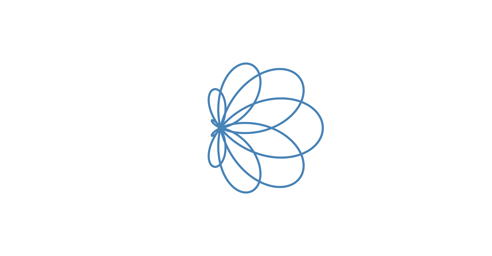

# epicycles.js
Interactive implementation of mathematical epicycles using p5.js. Allows for visual representation of Fourier series and pretty shapes (such as Spirograph patterns).

## Details

Click "add epicycles" to add an epicycle. Adjust the first and second sliders on the bottom to adjust the radius and velocity of the epicycle, respectively. Ajust the slider at the top to change the speed of the simulation. 

## How to plot Fourier Series

You can also input numeric or variable values for the radii and velocities of the epicycles. To simulate an infinite Fourier series, use the variable `j`, which represents the index of the epicycle (starting from zero), and press "duplicate 100". For example, to plot the **square wave**, paste in 

`2/(2*math.pi*2*(j+1))` in the radius input and

`2*(j+1)` for the velocity input.

Some other I found:

**Sawtooth Wave**:

`100/(j+1)`

`(2*(j+1))*2`

**Triangle path generator:** 

`(j+1)%3==0 ? v=0: v=100/(pow(j+1,2))`
`(j+1)%3==0 ? v=0: v=(j+1)*pow(-1,j%3+1)`

**Weierstrass Fractal** (continuous everywhere, differentiable nowhere)

`300/pow(3,j)`

`pow(3,(j))`

